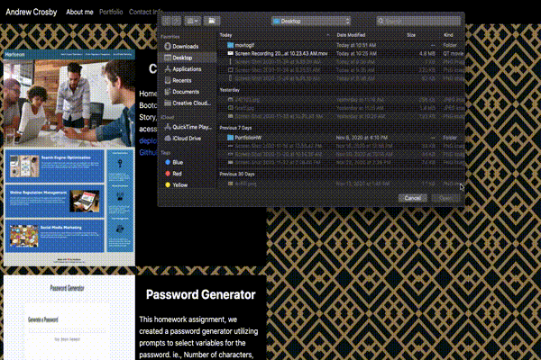

# PortfolioHW

Our homework assignment was to create a Responsive portfolio webpage that is compatible with mobile devices using Bootstrap elements. 

## Our Directions and Guidelines

* Create the following files files: `index.html`, `portfolio.html` and `contact.html`.

* Using Bootstrap, develop your portfolio site with the following items:

   * A navbar

   * A responsive layout

   * Responsive images

* The Bootstrap portfolio should minimize the use of media queries.

* Screenshots are provided as a reference in the `Assets/Images` folder. Your app does not need to be _exactly_ like the images. Use Bootstrap to create a similar, responsive layout.

## Feedback

This assignment was very hard to complete and a lot of the Bootstrap elements I did not understand fully. However, Bootstrap's website helped greatly while trying to figure it out.  

## Screengrabs

#### Links

* https://github.com/Crozarts/PortfolioHW

* https://crozarts.github.io/PortfolioHW/